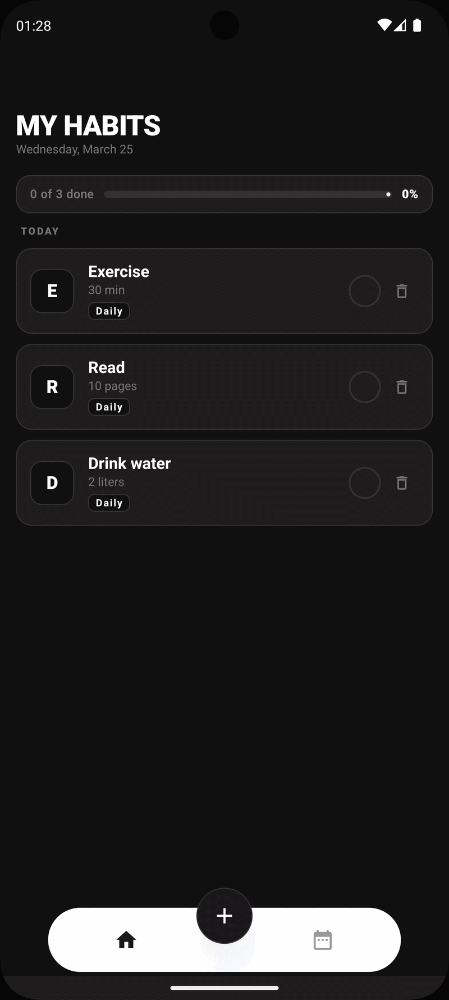

# HabitTracker

A daily habit tracker for Android built with Kotlin and Jetpack Compose.

## Features

- Create, delete and complete daily habits
- Toggle completion with visual feedback (strikethrough, color change)
- Daily progress bar showing completion percentage
- Statistics screen with overview and per-habit counts
- B&W theme with outlined design
- Floating pill navbar with central add button

## Preview

<p align="center">
  
</p>

## Tech Stack

| Layer | Technology |
|-------|-----------|
| UI | Jetpack Compose + Material 3 |
| Architecture | Clean Architecture + MVI |
| DI | Hilt |
| Database | Room |
| Navigation | Compose Navigation |
| Async | Kotlin Coroutines + Flow |
| Testing | JUnit + Turbine + Fake Repository |

## Project Structure

```
app/src/main/java/com/mauro/habittracker/
├── core/domain/          # Models, repository interface, use cases
├── data/                 # Room entities, DAOs, mappers, repository impl
├── feature/habits/       # Habits screen (MVI)
├── feature/statistics/   # Statistics screen (MVI)
├── navigation/           # NavGraph with bottom bar
└── ui/theme/             # Colors, typography, theme
```

## Getting Started

1. Clone the repo
2. Open in Android Studio (Ladybug or newer)
3. Sync Gradle
4. Run on emulator or device (minSdk 24)

## Testing

```bash
./gradlew testDebugUnitTest
```

## License

MIT
